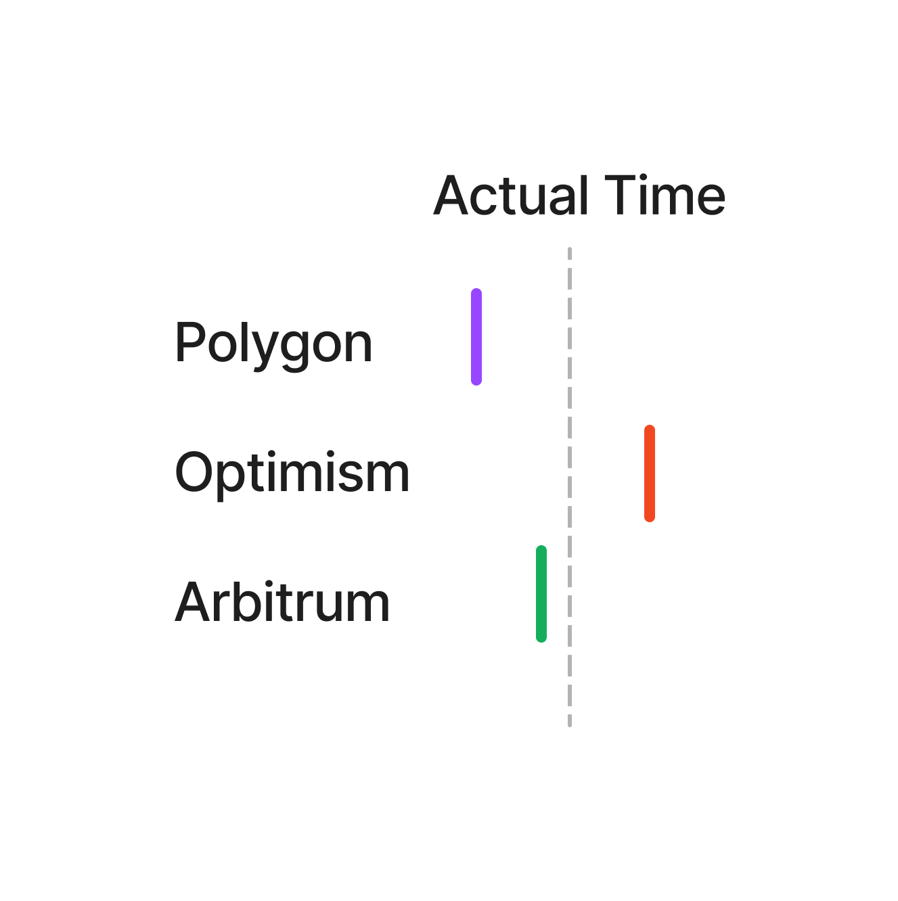
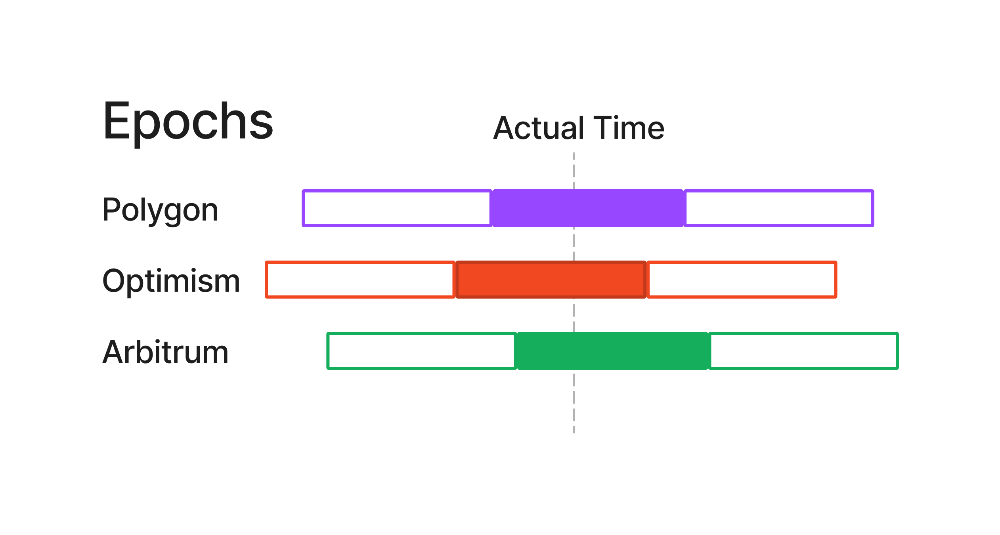
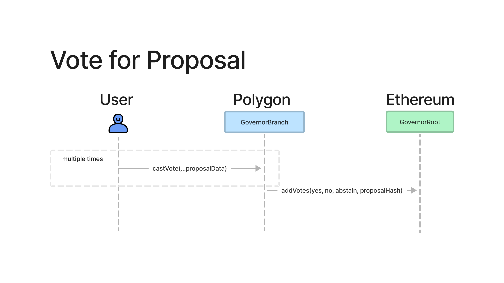

# Multi-Chain Governance Voting by Epoch

# Abstract

This specification is an extension to [Multi-Chain Governance Proposals](./MultiChainProposals.md) that affords the ability to vote using standard ERC20 tokens. This specification mitigates security risks arising from clock differences between chains.

# Motivation

Many protocols need to govern smart contracts across Ethereum, Ethereum L2s, and EVM-compatible sidechains. This specification aims to standardize a multi-chain voting specification so that DAOs can leverage common infrastructure.

Typically protocols will bridge their token from Ethereum to other L2s and sidechains using whitelabel ERC20 bridges. This means that the token on the L2 or sidechain will be a plain ERC20. To add voting capabilities to the token it needs to be wrapped in a contract. To measure historic voting power vote escrow contracts nearly always use the block number or the timestamp as the clock reference.

Ethereum block numbers cannot be used, because they are not universal. Sidechains such as Polygon do not have access to the current Ethereum block number.

Timestamps are much more universal, but clock times across L2s and sidechains are not consistent. This could be a problem, because if we measure a users vote at a certain timestamp it's possible for them to transfer their tokens and record a balance on two chains *at the same timestamp*.



For a governance system it's a significant problem if users are able to double-vote.

# Specification

The key words “MUST”, “MUST NOT”, “REQUIRED”, “SHALL”, “SHALL NOT”, “SHOULD”, “SHOULD NOT”, “RECOMMENDED”, “MAY”, and “OPTIONAL” in this document are to be interpreted as described in [RFC 2119](https://datatracker.ietf.org/doc/html/rfc2119).

The EpochVoter contract is a tokenized wrapper for ERC20 tokens. The contract adds the ability for users to delegate a portion of their balance to others, and records the historic voting power held by a user.  A users voting power is their undelegated balance plus any balances that were delegated to them.

The historic voting power of a user is divided into *epochs*. An epoch is a long enough span of time such that the epochs *must overlap between chains*.



When a user transfers EpochVoter tokens, the contract will record the *minimum balance held by the user during the epoch*. This ensures that users cannot double-vote: the voting power for an epoch excludes tokens that have moved.

Below is the specification for the EpochVoter contract, and extensions to the GovernorBranch and the GovernorRoot contracts.

## Definitions

**ProposalInfo**

```solidity
struct ProposalInfo {
    uint rootNonce;
    uint branchChainId;
    address branchAddress;
    uint branchNonce;
    bytes32 callHash;
    bytes data;
}
```

**ProposalState**

```solidity
enum ProposalState {
    Pending,
    Active,
    Cancelled,
    Ended,
    Defeated,
    Succeeded,
    Queued,
    Expired,
    Executed
}
```

## EpochVoter

The EpochVoter contract tracks users voting power during epochs. An epoch is range of time; the current epoch can be calculated by taking `current time % epoch length`. The length of an epoch should enough to safely cover the possible clock differences between sidechains and L2s.  For example, if two L2s have seen 15 minutes of difference then the epoch length could be two hours in order to safely cover the maximum possible difference.

A user's voting power is the *minimum* balance they had delegated to them during an epoch. This prevents double-voting, because this effectively excludes any sending or receiving of tokens during an epoch.

### Methods

**votesAtTime**

Returns the amount of voting power held by a user during the epoch that occurred at `timestamp`.

A users voting power is balance of tokens have been delegated to them. The voting power of a user should be the smallest balance that they held during the epoch. This ensures that any movement of tokens is ignored; only tokens that are held for the entire epoch are eligible.

```yaml
- name: votesAtTime
  type: function
  stateMutability: view
  inputs: 
    - name: timestamp
      type: uint256
```

**votesAtEpoch**

Returns the amount of voting power held by a user during the given `epoch`.

A users voting power is their balance plus the tokens that have been delegated to them. The voting power of a user should be the smallest balance that they held during the epoch. This ensures that any movement of tokens is ignored; only tokens that are held for the entire epoch are eligible.

```yaml
- name: votesAtEpoch
  type: function
  stateMutability: view
  inputs: 
    - name: epoch
      type: uint256
  outputs:
    - name: votes
      type: uint256
```

**delegate**

Delegates a portion of a users balance to another user. This will decrease their token balance and increase their delegated balance.

```yaml
- name: delegate
  type: function
  stateMutability: view
  inputs: 
    - name: delegate
      type: address
    - name: amount
      type: uint256
```

**undelegate**

Undelegates balance from a delegate back to the user. This will decrease their delegated balance and increase their token balance.

```yaml
- name: undelegate
  type: function
  stateMutability: view
  inputs: 
    - name: delegate
      type: address
    - name: amount
      type: uint256
```

**delegateBalanceOf**


**delegatedBalanceOf**

Returns the total number of tokens a user has delegated to others.

```yaml
- name: delegatedBalanceOf
  type: function
  stateMutability: view
  inputs: 
    - name: account
      type: address
  outputs:
    - name: balance
      type: uint256
```

**epochLength**

Return the length of the epoch in seconds.

```yaml
- name: epochLength
  type: function
  stateMutability: view
  output: 
    - name: epochLength
      type: uint256
```

**epochToTimestamp**

Converts a given epoch to a timestamp

```yaml
- name: epochToTimestamp
  type: function
  stateMutability: view
  inputs: 
    - name: epochLength
      type: uint256
```

**timestampToEpoch**

Calculates the epoch given a timestamp

**epochStartTime**

Returns the time at which epochs start.

## GovernorBranch

### Methods

**castVote**

Allows a user to vote for a proposal. The proposal info is passed so that the proposal hash can be calculated for verification. The `support` options are: 0 = Against, 1 = For, 2 = Abstain. The users vote will be added to the appropriate support total for that proposal.

MUST NOT allow a user to vote twice for a proposal.

MUST emit the `VoteCast` event.

MUST revert if the current time is greater than the proposal `endTime`.

MUST revert if `support` is not one 0, 1 or 2.

```yaml
- name: castVote
  type: function
  stateMutability: nonpayable
  inputs: 
    - name: support
      type: uint8
    - name: proposal
      type: ProposalInfo
```

### Events

**VoteCast**

Emitted when a user casts their vote.

```yaml
- name: VoteCast
  type: event
  inputs:
    - name: proposalHash
      type: bytes32
    - name: voter
      type: address
    - name: support
      type: uint8
    - name: votes
      type: uint256
```

## GovernorRoot

The GovernorRoot contract has vote "aggregators", 

### Methods

**addVotes**

Add votes to the root from an aggregator.

MUST emit the `VotesAdded` event.

SHOULD only be callable by an authorized aggregator (such as a GovernorBranch or bridge).

```yaml
- name: addVotes
  type: function
  stateMutability: nonpayable
  inputs:
    - name: branchChainId
      type: uint256
    - name: branchAddress
      type: address
    - name: yesVotes
      type: uint256
    - name: noVotes
      type: uint256
    - name: abstainVotes
      type: uint256
    - name: proposalHash
      type: bytes32
```

**gracePeriod**

The grace period is the amount of time after a proposal ends during which aggregators can add their votes.

```yaml
- name: gracePeriod
  type: function
  stateMutability: view
  outputs:
    - name: duration
      type: uint256
```

**proposalStatus**

Returns the status of a proposal:

- Active: the proposal has not yet ended
- Ended: the proposal has ended but the votes are not yet in
- Succeeded: voting has completed and the proposal has passed
- Defeated: voting has completed and the proposal did not pass

```yaml
- name: proposalStatus
  type: function
  stateMutability: view
  inputs:
    - name: proposalHash
      type: bytes32
  outputs:
    - name: status
      type: ProposalState
```

**createProposal**

The multi-chain voting extension to the original [GovernorRoot](./MultiChainProposals.md) records additional epoch-specific information.

The `epochStart` is the most recent epoch that has passed. The epoch must have ended before the current time.

The `endTime` is the timestamp before which votes must be submitted to the GovernorBranch contracts.

The above MUST be abi-encoded as (`epochStart`, `endTime`) and emitted as the implementation-specific `data` parameter in the event `ProposalCreated`.

### Events

**VotesAdded**

Emitted when the final vote count comes in for a GovernorBranch

```yaml
- name: VotesAdded
  type: event
  inputs:
    - name: branchChainId
      type: uint256
    - name: branchAddress
      type: address
    - name: yesVotes
      type: uint256
    - name: noVotes
      type: uint256
    - name: abstainVotes
      type: uint256
    - name: proposalHash
      type: bytes32
```

# Rationale

Prevents double voting across chains.

## Flow Diagram



# Backwards Compatibility

None

# Test Cases

TBD

# Reference Implementation

TBD

# Security Considerations

This specification requires users to hold a minimum amount of tokens for a time range. This time range should be configured to exceed the expected maximum clock difference between chains.
