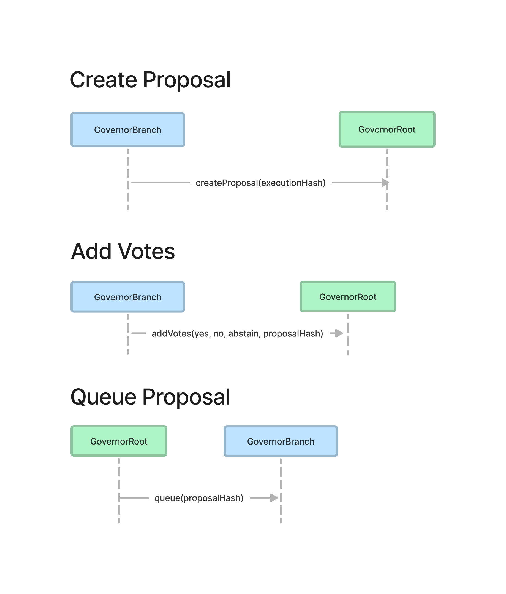
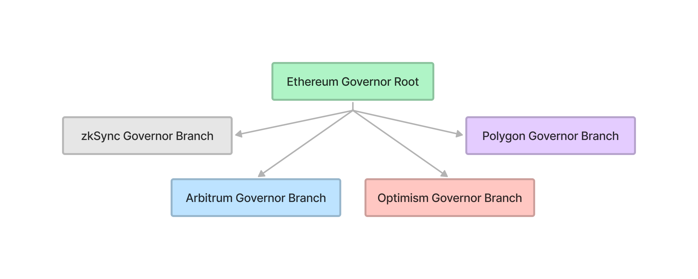

# Multi-Chain Governance

# Abstract

This specification allows token holders to vote and approve on state changes across multiple chains (Ethereum, L2s, and sidechains). The model is similar to the existing Compound-style governance, but separates proposal execution from consensus:

1. A proposal is created on a governance "branch".
2. Votes are aggregated on each branch and sent to the governance "root" for consensus.
3. If a proposal passes, the root queues the proposal hash on branches that require execution.
4. Anyone can execute a queued proposal on a branch.

# Motivation

Many protocols need to govern smart contracts across Ethereum, L2s, and sidechains. This specification aims to standardize a multi-chain governance system so that DAOs can leverage common infrastructure.

The most popular governance system is Compound protocol's GovernorAlpha; this contract has seen numerous derivatives, including OpenZeppelin's excellent Governor contract. These contracts co-locate consensus with execution, however, making them impractical to use across multiple chains.

We need a governance system that is flexible enough to add new chains and efficient such that cross-chain messages are minimized.

# Specification

The key words “MUST”, “MUST NOT”, “REQUIRED”, “SHALL”, “SHALL NOT”, “SHOULD”, “SHOULD NOT”, “RECOMMENDED”, “MAY”, and “OPTIONAL” in this document are to be interpreted as described in [RFC 2119](https://datatracker.ietf.org/doc/html/rfc2119).

## Definitions

```solidity

struct Call {
    uint256 chainId;
    address caller;
    address target;
    uint256 value;
    bytes data;
}

```

## GovernorBranch

The Governor Branch is a smart contract deployed to each chain that the protocol wishes to execute on. Users on that chain create, vote, and execute on proposals through the Governor Branch. The Governor Branch creates proposals and sends vote aggregates to its Governor Root. If a proposal passes, the Governor Root tells the branch to queue the proposal.  The Govornor Root may exist on another chain, so the branch could be communicating with a proxy.

### Methods

**createProposal**

MUST emit the `BranchCreatedProposal` event when successfully called.

MUST increment the branch nonce for each proposal request. Each GovernorBranch tracks its own branch nonce.

MUST call `createProposal` in the associated `GovernorRoot` contract, whether directly or indirectly (as through a bridge).

RECOMMENDED only be callable by appropriate users (those with sufficient tokens, for example).

```yaml
- name: createProposal
  type: function
  stateMutability: nonpayable
  inputs: 
    - name: calls
      type: Call[]
    - name: message
      type: bytes
  outputs:
    - name: executionHash
      type: bytes32
    - name: branchNonce
      type: uint
```

**castVote**

Allows a user to vote for a proposal. The proposal info is passed so that the proposal hash can be calculated for verification. The `support` options are: 0 = Against, 1 = For, 2 = Abstain. The users vote will be added to the appropriate support total for that proposal.

MUST NOT allow a user to vote twice for a proposal.

MUST emit the `VoteCast` event.

MUST revert if the current time is greater than the proposal `endTime`.

MUST revert if `support` is not one 0, 1 or 2.

MUST revert if `startEpoch` is the current epoch or in the future.

MUST record the users votes from the Epoch Voter at the `startEpoch` of the proposal.

```yaml
- name: castVote
  type: function
  stateMutability: nonpayable
  inputs: 
    - name: executionHash
      type: bytes32
    - name: rootNonce
      type: uint256
    - name: startEpoch
      type: uint32
    - name: endTimestamp
      type: uint64
    - name: support
      type: uint8
```

**queueProposal**

MUST emit a `QueuedProposal` event.

MUST only be callable by an authorized contract, whether the `GovernorRoot` itself, or from a bridge.

```yaml
- name: queueProposal
  type: function
  stateMutability: nonpayable
  inputs: 
    - name: proposalHash
      indexed: true
      type: bytes32
```

**executeProposal**

Executes, in order, any applicable calls in the given proposal. Applicable calls may be where the `chainId` matches the `GovernorBranch` chainId and whose `caller` matches the `GovernorBranch` address, or it could be a proxy contract that the branch controls.

MUST emit a `ExecutedProposal` event.

MUST revert if already called

MUST NOT execute a proposal that has not been queued.

```yaml
- name: executeProposal
  type: function
  stateMutability: payable
  inputs:
    - name: branchChainId
      type: uint256
    - name: branchAddress
      type: address
    - name: branchNonce
      type: uint256
    - name: calls
      type: Call[]
    - name: rootNonce
      type: uint256
    - name: startEpoch
      type: uint32
    - name: endTimestamp
      type: uint64
```

### Events

**BranchCreatedProposal**

MUST be emitted when a GovernorBranch requests a new proposal.

```yaml
- name: BranchCreatedProposal
  type: event

  inputs:
    - name: executionHash
      indexed: true
      type: bytes32
    - name: branchNonce
      indexed: true
      type: uint
    - name: calls
      type: Call[]
    - name: message
      type: bytes
```

**VoteCast**

MUST be emitted when a user casts their vote.

```yaml
- name: VoteCast
  type: event
  inputs:
    - name: proposalHash
      type: bytes32
    - name: voter
      type: address
    - name: support
      type: uint8
    - name: votes
      type: uint256
```

**QueuedProposal**

MUST be emitted when a GovernorBranch queues a proposal.

```yaml
- name: QueuedProposal
  type: event

  inputs:
    - name: proposalHash
      type: bytes32
```

**ExecutedProposal**

MUST be emitted when a GovernorBranch executes a proposal

```yaml
- name: ExecutedProposal
  type: event
  
  inputs:
    - name: executionHash
      type: bytes32
    - name: proposalHash
      type: bytes32
```

## GovernorRoot

The GovernorRoot contract allows branches to creates proposals and aggregate votes.  When a proposal passes, the Governor Root can queue proposals on branches that require execution.

### Methods

**createProposal**

MUST emit the `ProposalCreated` event.

MUST only be callable by authorized contracts (GovernorBranches, or bridge contracts).

The `proposalHash` output value is a keccak hash of the ABI-encoded:
- `executionHash`: Keccak hash of the abi-encoded (`branchChainId`, `branchAddress`, `branchNonce`, `callsHash`)
- `rootNonce`: incremented every time `createProposal` is called. The nonce is specific to the GovernorRoot.
- `epoch`: Epoch to measure votes at
- `endTimestamp`: The time at which to stop counting votes

```yaml
- name: createProposal
  type: function
  stateMutability: nonpayable
  inputs: 
    - name: executionHash
      type: bytes32
  outputs:
    - name: rootNonce
      type: uint
    - name: proposalHash
      type: bytes32
    - name: epoch
      type: uint32
    - name: endTimestamp
      type: uint64
```

**addVotes**

MUST emit the `AddedVotes` event.

MUST only be callable by authorized contracts (GovernorBranches, or bridge contracts).

MUST REVERT if called more than once by msg.sender

```yaml
- name: addVotes
  type: function
  stateMutability: nonpayable
  inputs:
    - name: againstVotes
      type: uint256
    - name: forVotes
      type: uint256
    - name: abstainVotes
      type: uint256
    - name: proposalHash
      type: bytes32
  outputs:
    - name: success
      type: bool
```

### Events

**ProposalCreated**

MUST be emitted when a GovernorRoot creates a new proposal.

```yaml
- name: ProposalCreated
  type: event

  inputs:
    - name: rootNonce
      indexed: true
      type: uint
    - name: proposalHash
      indexed: true
      type: bytes32
    - name: branchChainId
      type: uint
    - name: branchAddress
      type: address
    - name: branchNonce
      type: uint
    - name: callsHash
      type: bytes32
    - name: data
      type: bytes
```

**AddedVotes**

MUST be emitted when votes are added

```yaml
- name: AddedVotes
  type: event

  inputs:
    - name: proposalHash
      indexed: true
      type: bytes32
    - name: againstVotes
      type: uint256
    - name: forVotes
      type: uint256
    - name: abstainVotes
      type: uint256
    - name: from
      type: address
```

## EpochVoter

The EpochVoter contract tracks a users voting power. Both Governor Branch and Governor Root use the Epoch Voter, so the Epoch Voter must be present everywhere those contracts are.

Voting power is tracked as the *minimum balance held during an epoch*. An epoch is a large unit of time.  See below for details.

Epoch Voter contracts are synchronized across chains by ensuring their start timestamp and epoch durations match.  The epoch duration must be more than long enough to cover clock differences between chains.

### Methods

**currentEpoch**

MUST return the current epoch

```yaml
- name: currentEpoch
  type: function
  stateMutability: constant
  outputs:
    - name: epoch
      type: uint
```

**currentVotes**

MUST return the voting power of a user at the current epoch. This power can change until the epoch has passed.

```yaml
- name: currentVotes
  type: function
  stateMutability: constant
  inputs:
    - name: account
      type: address
  outputs:
    - name: votes
      type: uint
```

**votesAtEpoch**

MUST return the voting power of a user at a particular epoch.

MUST revert if the epoch has not passed.

```yaml
- name: votesAtEpoch
  type: function
  stateMutability: constant
  inputs:
    - name: account
      type: address
    - name: epoch
      type: uint
  outputs:
    - name: votes
      type: uint
```

# Rationale

## Epochs Mitigate Double-Voting

Double-voting is the risk that a user can vote more than once. In a naive system which measures a users balance at a certain timestamp, it's possible for a user to bridge their tokens and have the same balance for the same timestamp across two chains:


This problem can be mitigated by using *epochs*. Time is evenly divided into epochs. An epoch is long enough to ensure that they overlap across chains, no matter what the minor relative clock differences are.


By tracking voting power by the minimum balance for a given epoch, we can ensure that users cannot double-vote.

## Data Lives Off-Chain

One of the major goals of this specification is to keep *as much data off-chain as possible*. This has two benefits:

1. Less data is written to the chain, making the system cheaper to run.
2. Minimizes the number of cross-chain messages. Proposal data can supplied by the caller and verified using the proposal hash.

### Minimal Cross-Chain Messages

Let's count the number of messages:

1. Create proposal message from a branch -> root. (1)
2. Add votes message from each branch -> root. (number of branches)
3. Queue proposal message from root -> branch only for *branches that require execution*. (1 - number of branches)

Worst case scenario we'll have `1 + 2*(number of branches)` number of cross-chain messages.



## Governance is Modular

It's expected that there will be more chains or L2s in the future. Having a root and branches is a simple topology that makes adding new chains easy.



# Backwards Compatibility

This system is can be easily adapted to support the original Compound Governor Timelock contract, which protocols to swap out the old Governor Alpha for this spec.

# Reference Implementation

There is a reference implementation [on Github](https://github.com/pooltogether/multichain-gov-contracts). The project uses Foundry.

# Security Considerations

The single biggest security risk is the cross-chain transport layer. Ethereum L2s such as zk-rollups and optimisic rollups inherit the base layer security, but sidechains such as Polygon do not.

## Worst-Case Scenario: Bridge Compromised

Let's assume one of the bridges has been compromised. What is our exposure?

### GovernorBranch: queueProposal

The attacker could queue arbitrary code on the Governor Branch on that bridge. The scope of damage will be anything under the branch's control.

Mitigations:

- Allow branches to set queuing delays. This will give people time to exit before the proposal takes effect.
- Add a "guardian" to branches that can cancel proposals. However, this could introduce censorship issues unless it's carefully managed.

### GovernorRoot: createProposal.

The attacker could create proposals without holding tokens.

Mitigations:

- Only allow proposal creation from certain bridges.

### GovernorRoot: addVotes

The attacker could control the branch's entire vote, including inflating the vote counts giving them majority power.

Mitigations:

- Limit branch voting power. Voting could be limited by how many tokens are locked in the bridge.
