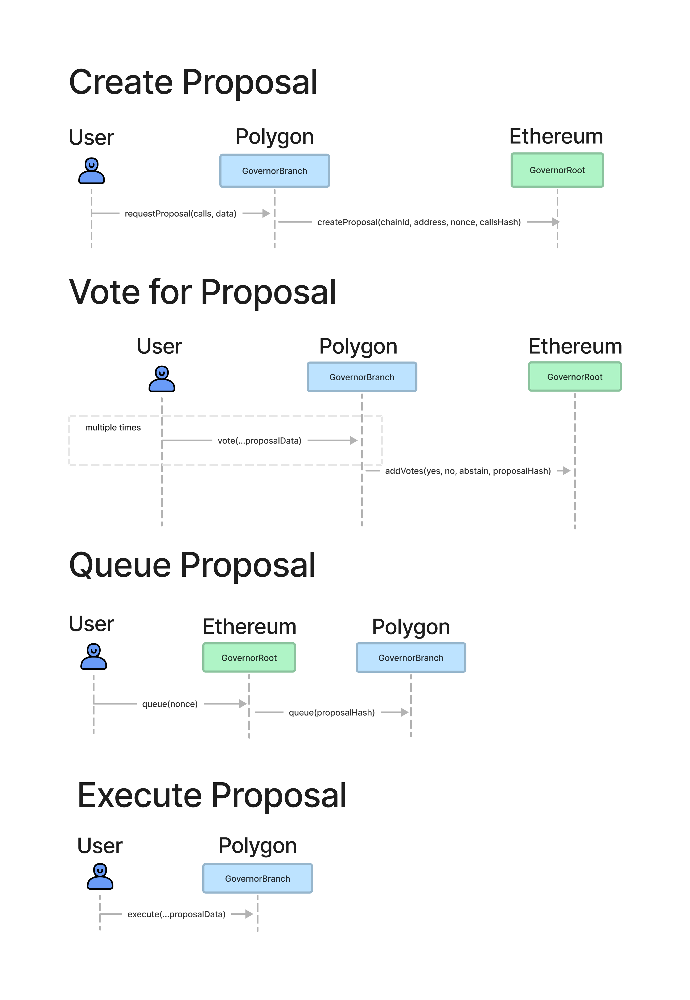

# Multi-Chain Governance Proposals

# Abstract

This specification defines a multi-chain governance proposal API, so that protocols can vote and approve on state changes across multiple chains (Ethereum, Ethereum L2s, and sidechains).

# Motivation

Many protocols need to govern smart contracts across Ethereum, Ethereum L2s, and EVM-compatible sidechains. This specification aims to standardize a multi-chain proposal structure so that DAOs can leverage common infrastructure.

The most common governance system is Compound protocol's GovernorAlpha; this contract has been cloned and seen numerous derivatives. The GovernorAlpha, however, stores transaction data on-chain and does not have any facilities for multi-chain coordination. This specification aims to standardize the way that proposals operate across multiple EVM-compatible chains and L2s.

# Specification

The key words “MUST”, “MUST NOT”, “REQUIRED”, “SHALL”, “SHALL NOT”, “SHOULD”, “SHOULD NOT”, “RECOMMENDED”, “MAY”, and “OPTIONAL” in this document are to be interpreted as described in [RFC 2119](https://datatracker.ietf.org/doc/html/rfc2119).

This specification introduces the GovernorBranch and the GovernorRoot contracts.  Each root may have multiple branches. Users create proposals through the branches, and the root acts as the final arbiter as to whether the proposals are executed.

## Definitions

**Call struct**

```solidity
struct Call {
    uint256 chainId;
    address caller;
    address target;
    uint256 value;
    bytes data;
}
```

## GovernorBranch

### Methods

**requestProposal**

MUST emit the `ProposalRequested` event when successfully called.

MUST increment the branch nonce for each proposal request. Each GovernorBranch tracks its own branch nonce.

SHOULD only be callable by appropriate users (those with sufficient tokens, for example).

SHOULD trigger a `createProposal` call in the associated `GovernorRoot` contract, whether directly or indirectly (as through a bridge).

```yaml
- name: requestProposal
  type: function
  stateMutability: nonpayable
  inputs: 
    - name: calls
      type: Call[]
    - name: data
      type: bytes
  outputs:
    - name: branchNonce
      type: uint
```

**queueProposal**

MUST emit a `ProposalQueued` event.

SHOULD only be callable by an authorized contract, whether the `GovernorRoot` itself, or from a bridge.

```yaml
- name: queueProposal
  type: function
  stateMutability: nonpayable
  inputs: 
    - name: proposalHash
      indexed: true
      type: bytes32
```

**executeProposal**

Executes, in order, any calls in the given proposal whose `chainId` matches the `GovernorBranch` chainId, and whose `caller` matches the `GovernorBranch` address.

MUST emit a `ProposalExecuted` event.

MUST only be called once.

MUST NOT execute a proposal that has not been queued.

```yaml
- name: executeProposal
  type: function
  stateMutability: payable
  inputs:
    - name: rootNonce
      type: uint
    - name: startTime
      type: uint
    - name: endTime
      type: uint
    - name: branchChainId
      type: uint
    - name: branchAddress
      type: address
    - name: branchNonce
      type: uint
    - name: calls
      type: Call[]
```

### Events

**ProposalRequested**

MUST be emitted when a GovernorBranch requests a new proposal.

```yaml
- name: ProposalRequested
  type: event

  inputs:
    - name: branchNonce
      indexed: true
      type: uint
    - name: calls
      type: Call[]
    - name: data
      type: bytes
```

**ProposalQueued**

MUST be emitted when a GovernorBranch queues a proposal.

```yaml
- name: ProposalQueued
  type: event

  inputs:
    - name: proposalHash
      type: bytes32
```

**ProposalExecuted**

MUST be emitted when a GovernorBranch executes a proposal

```yaml
- name: ProposalExecuted
  type: event
  
  inputs:
    - name: proposalHash
      type: bytes32
```

## GovernorRoot

### Methods

**createProposal**

MUST emit the `ProposalCreated` event.

SHOULD only be callable by authorized contracts (GovernorBranches, or bridge contracts).

The `rootNonce` must be incremented every time `createProposal` is called. The nonce is specific to the GovernorRoot.

The `callsHash` parameter is a keccak hash of the ABI-encoded `Call[]` array.

The `startTime` and `endTime` timestamps are determined by the GovernorRoot. They represent the timespan in which voting may occur. Calculating a user's vote is outside the scope of this proposal.

The `proposalHash` output value is a keccak hash of the ABI-encoded:
- `rootNonce`
- `startTime`
- `endTime`
- `branchChainId`
- `branchAddress`
- `branchNonce`
- `callsHash`

```yaml
- name: createProposal
  type: function
  stateMutability: nonpayable
  inputs: 
    - name: branchChainId
      type: uint
    - name: branchAddress
      type: address
    - name: branchNonce
      type: uint
    - name: callsHash
      type: bytes32
  outputs:
    - name: rootNonce
      type: uint
    - name: proposalHash
      type: bytes32
```

**queueProposal**

MUST emit the `ProposalQueued` event.

MUST revert if the proposal was previously queued.

SHOULD only queue if the proposal has passed some criteria (such as voting).

SHOULD call `queueProposal` on all `GovernorRoot` contracts, whether directly or indirectly through a bridge or proxy.

```yaml
- name: queueProposal
  type: function
  stateMutability: nonpayable
  inputs: 
    - name: rootNonce
      type: uint
```

### Events

**ProposalCreated**

MUST be emitted when a GovernorRoot creates a new proposal.

```yaml
- name: ProposalCreated
  type: event

  inputs:
    - name: rootNonce
      indexed: true
      type: uint
    - name: proposalHash
      indexed: true
      type: bytes32
    - name: branchChainId
      type: uint
    - name: branchAddress
      type: address
    - name: branchNonce
      type: uint
    - name: callsHash
      type: bytes32
```

# Rationale

Much of the complexity in a multi-chain governance system lies in cross-chain messages. Sending messages across chains can be expensive, time consuming, and asynchronous. One of the major goals of this specification is to keep *as much data off-chain as possible*. This is why users provide the full transaction data when executing; so that they can prove the contents of a proposal instead of retreiving it.

## Bridge Minimization

The proposal flow is illustrated below. The voting action is included for completeness, although it's not part of this spec.

Notice how there are only two messages that go across the bridge: `createProposal` and `queueProposal`. The messages have O(1) size, and so overhead remains constant no matter how large the proposal.



# Backwards Compatibility

This specification builds on the [OpenZeppelin Governor](https://github.com/OpenZeppelin/openzeppelin-contracts/blob/master/contracts/governance/IGovernor.sol) implementation, but is not backwards-compatible with it.

# Test Cases

TBD

# Reference Implementation

TBD

# Security Considerations

There are two significant security risks that will depend on the implementation of the specification. The first is the selection of the cross-chain communication bridges, and the second is mitigating clock drift between chains.

The biggest security risk when messaging across chains is the messaging bridge. Ethereum L2s such as zk-rollups and optimisic rollups inherit the base layer security, but sidechains such as Polygon do not. This specification is bridge-agnostic, so that each DAO can accept the level of risk that they are willing to shoulder. The structure of proposals across EVM-compatible chains can be the same, but the risk profile may not be.

Not all L2s and sidechains have the same timestamp as the Etheruem chain. They are likely very close, but they will never be exact. In this way, it is critically important that the GovernorBranch implmementations can mitigate clock drift. While the risk lies outside the scope of the above proposal, it is an extremely important consideration.